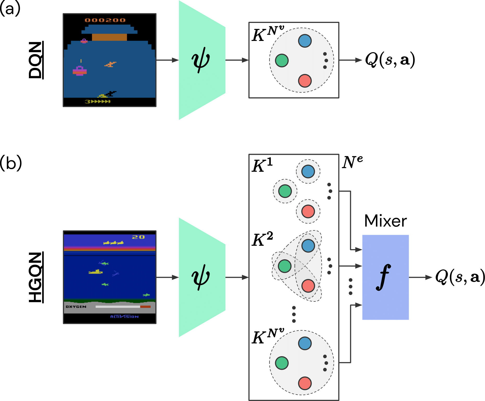
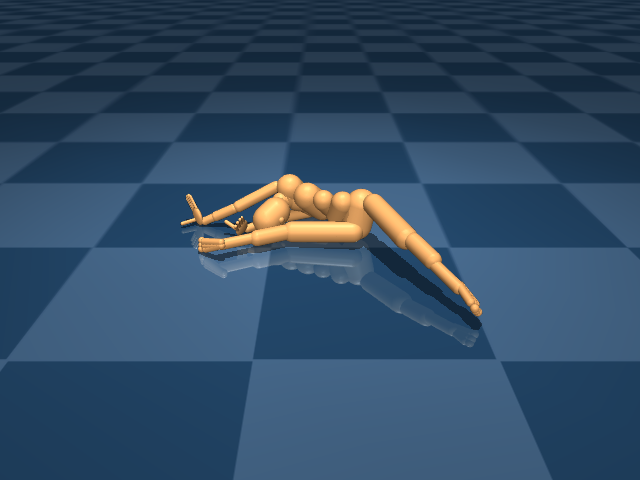
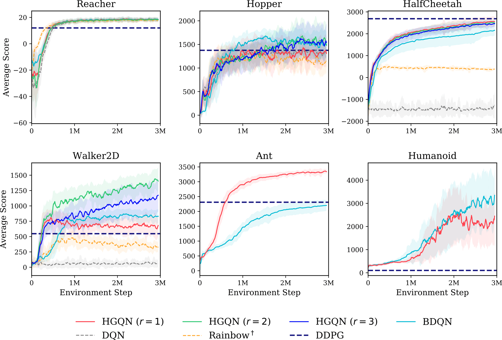

# Learning to Represent Action Values as a Hypergraph on the Action Vertices

Implementation of the *hypergraph Q-networks* (**HGQN**) agent in TensorFlow, built on Dopamine ([Castro et al., 2018][dopamine]).

<p align="center">

</p>

If you find this code useful, please cite the [paper][this_paper]:


> Tavakoli, A., Fatemi, M., and Kormushev, P. (2021). Learning to represent action values as a hypergraph on the action vertices. In *Proceedings of the 9th International Conference on Learning Representations (ICLR)*.

In BibTeX format:

```
@inproceedings{tavakoli2021learning,
   title={Learning to Represent Action Values as a Hypergraph on the Action Vertices},
   author={Arash Tavakoli and Mehdi Fatemi and Petar Kormushev},
   booktitle={International Conference on Learning Representations},
   year={2021},
   url={https://openreview.net/forum?id=Xv_s64FiXTv}
}
```

# Method

Action-value estimation is a critical component of many reinforcement learning methods whereby sample complexity relies heavily on how fast a good estimator for action value can be learned. By viewing this problem through the lens of representation learning, good representations of both state and action can facilitate action-value estimation. While advances in deep learning have seamlessly driven progress in learning state representations, given the specificity of the notion of agency to reinforcement learning, little attention has been paid to learning action representations. We conjecture that leveraging the combinatorial structure of multi-dimensional action spaces is a key ingredient for learning good representations of action. To test this, we set forth the *action hypergraph networks* framework - a class of functions for learning action representations in multi-dimensional discrete action spaces with a structural inductive bias. Using this framework we realise an agent class based on a combination with *deep Q-networks* (**DQN** by [Mnih et al., 2015][dqn]), which we dub *hypergraph Q-networks* (**HGQN**).
Using this agent class, we show the effectivess of our approach on a myriad of domains: Atari 2600 games and discretised physical control benchmarks.

<p align="center">

</p>

If you are interested to know more about HGQN or, more generally, about *action hypergraph networks*, consider checking the following resources:

- [**ICLR presentation**](https://slideslive.com/38953681)
- [**Research paper**][this_paper]
- [**Video demonstrations**](https://www.youtube.com/playlist?list=PL8HRlHFsulhaSIoMlyAnKt8zGVEM9G6fd)


# Quick Start

## Installation

To use the proposed agents and baselines, you need to install `python3` and make sure `pip` is up to date. If you want to experiment with [PyBullet][pybullet], [DeepMind Control Suite][dmc] (DMC), or [OpenAI Gym][gym] (MuJoCo or Box2D), you should install them separately. To do so, please check the following repositories:

- **PyBullet** (free, open-source): [github.com/bulletphysics/bullet3][pybullet]
- **DeepMind Control Suite**: [github.com/deepmind/dm_control][dmc]
- **OpenAI-Gym MuJoCo**: [github.com/openai/gym][gym]
- **OpenAI-Gym Box2D** (free, open-source): [github.com/openai/gym][gym]

To start using this repository, follow the steps below.

**1. Clone the repository:** 
```sh
git clone https://github.com/atavakol/action-hypergraph-networks
cd action-hypergraph-networks
```

**2. Create a virtual environment:**

If you do not wish to run this code in a `virtual environment`, you can skip this step.

First install [Anaconda](https://docs.anaconda.com/anaconda/install/) which
we will use as the environment manager, e.g. via:

```sh
wget https://repo.anaconda.com/archive/Anaconda3-2019.10-Linux-x86_64.sh
bash Anaconda3-2019.10-Linux-x86_64.sh
```

Then create an environment as below:

```sh
conda create --name hyperdopamine-env python=3.6
conda activate hyperdopamine-env
```

This will create a directory called `hyperdopamine-env` in which your virtual
environment lives. The last command activates the environment.

**3. Setup the environment and install dependencies:** 

Finally setup the virtual environment and install the main dependencies via:

```sh
pip install -U pip
sudo apt-get update && sudo apt-get install cmake zlib1g-dev
pip install -e .
conda install tensorflow-gpu==1.15
```

## Training Agents

This codebase is compatible with [Arcade Learning Environments][ale] (i.e. Atari 2600), [PyBullet][pybullet], [DeepMind Control Suite][dmc] (DMC), and [OpenAI Gym][gym] (MuJoCo or Box2D) environments. Each agent in the [paper][this_paper] (including all baselines except for DDPG) is configured by a `gin` file which can be used to reproduce the results in the paper, or to run the same agents in more environments. These configuration files can be modified directly or via the command-line to experiment with other environment or agent parameters. Next we outline how each agent can be run from the command-line by utilising the `gin` files.


### **Atari 2600 Games**

Use the following to run the agents in our main Atari 2600 experiment (set `agent` to `dqn` or `hgqn`). For HGQN, you can modify `hyperedge_orders` (default is `[1,2,3]`; `[1]`, `[2]`, `[1,2]`, `[1,3]`, and `[2,3]` are also valid choices) and `mixer` (default is `sum`; `universal` is supported too) in the agent's `gin` configuration file (located `hyperdopamine/agents/dqn/configs/hgqn_atari.gin`) to create arbitrary *action hypergraph networks* for the Atari 2600 suite.

```sh
agent=hgqn  # or dqn
environment=Zaxxon  # needs atari-py installed
seed=0
python -um hyperdopamine.interfaces.train \
  --base_dir=./logs/$environment/$agent/$seed \
  --gin_files="hyperdopamine/agents/dqn/configs/${agent}_atari.gin" \
  --gin_bindings="atari_lib.create_atari_environment.game_name='$environment'" \
  --gin_bindings="atari_lib.create_atari_environment.environment_seed=$seed" \
  --gin_bindings="Runner.agent_seed=$seed" \
  --schedule=continuous_train
```

### **DeepMind Control Suite, OpenAI Gym, and PyBullet Benchmarks**

To see the full list of physical control environments that are readily supported (as well as their metadata), please refer to `hyperdopamine/interfaces/environment_metadata.py`. 

Bootstrapping from *non-terminal timeout transitions* can significantly improve performance in environments which have short auxiliary time limits ([Pardo et al., 2018][time_limits]).
As such, in our physical control environments which have relatively short time limits, we apply this technique to all agents.

#### **HGQN**

Use the following to run HGQN in the popular physical control environments. You can modify `hyperedge_orders` and `mixer` (default is `sum`; `universal` is supported too) in `hyperdopamine/agents/rainbow/configs/hgqn.gin` to create arbitrary *action hypergraph networks* in such tasks. For example, for `environment = HopperBulletEnv` (with a 3-dimensional action space), setting `hyperedge_orders = [1,-1]` instantiates a model based on a hypergraph with all the 1-hyperedges and the single highest-order hyperedge (including `[-1]` captures the highest-order).

```sh
environment=BipedalWalker  # needs OpenAI-Gym Box2D installed
seed=0
python -um hyperdopamine.interfaces.train \
  --base_dir=./logs/$environment/hgqn-r2-sum/$seed \
  --gin_files="hyperdopamine/agents/rainbow/configs/hgqn.gin" \
  --gin_bindings="RainbowAgent.hyperedge_orders='[1,2]'" \
  --gin_bindings="RainbowAgent.mixer='sum'" \
  --gin_bindings="RainbowAgent.observation_shape=%environment_metadata.${environment^^}_OBSERVATION_SHAPE" \
  --gin_bindings="create_discretised_environment.environment_name='$environment'" \
  --gin_bindings="create_discretised_environment.version=%environment_metadata.${environment^^}_ENV_VER" \
  --gin_bindings="create_discretised_environment.environment_seed=$seed" \
  --gin_bindings="Runner.max_steps_per_episode=%environment_metadata.${environment^^}_TIMELIMIT" \
  --gin_bindings="Runner.agent_seed=$seed" \
  --schedule=continuous_train_and_eval
```

#### **Rank-1 HGQN with a Monotonic Mixer**

As stated in the [paper][this_paper], the class of *rank-1 monotonic-mixer HGQN* agents can gracefully scale to very high-dimensional discrete action spaces. To achieve the respective computational benefits, we release a separate implementation of this class of agents. You can modify `mixing_network` (default is `sum_mixer`; `monotonic_linear_mixer` and `monotonic_nonlinear_mixer` are supported too) to achieve different *monotonic* mixing strategies.

```sh
environment=AntBulletEnv  # needs PyBullet installed
seed=0
python -um hyperdopamine.interfaces.train \
  --base_dir=./logs/$environment/hgqn-r1-sum/$seed \
  --gin_files="hyperdopamine/agents/hgqn_r1/configs/hgqn_r1.gin" \
  --gin_bindings="HGQNr1Agent.mixing_network=@networks.sum_mixer" \
  --gin_bindings="HGQNr1Agent.observation_shape=%environment_metadata.${environment^^}_OBSERVATION_SHAPE" \
  --gin_bindings="create_discretised_environment.environment_name='$environment'" \
  --gin_bindings="create_discretised_environment.version=%environment_metadata.${environment^^}_ENV_VER" \
  --gin_bindings="create_discretised_environment.environment_seed=$seed" \
  --gin_bindings="Runner.max_steps_per_episode=%environment_metadata.${environment^^}_TIMELIMIT" \
  --gin_bindings="Runner.agent_seed=$seed" \
  --gin_bindings="WrappedPrioritizedReplayBuffer.action_shape=%environment_metadata.${environment^^}_ACTION_SHAPE" \
  --schedule=continuous_train_and_eval
```

#### **Branching DQN**

We also release an implementation of the *Branching-DQN* (**BDQN**) agent ([Tavakoli et al., 2018][branching]), which can also scale to very high-dimensional discrete action spaces just as our *rank-1 monotonic-mixer HGQN* agent. 

```sh
environment=Humanoid  # needs OpenAI-Gym MuJoCo installed
seed=0
python -um hyperdopamine.interfaces.train \
  --base_dir=./logs/$environment/bdqn/$seed \
  --gin_files='hyperdopamine/agents/bdqn/configs/bdqn.gin' \
  --gin_bindings="BDQNAgent.observation_shape=%environment_metadata.${environment^^}_OBSERVATION_SHAPE" \
  --gin_bindings="create_discretised_environment.environment_name='$environment'" \
  --gin_bindings="create_discretised_environment.version=%environment_metadata.${environment^^}_ENV_VER" \
  --gin_bindings="create_discretised_environment.environment_seed=$seed" \
  --gin_bindings="Runner.max_steps_per_episode=%environment_metadata.${environment^^}_TIMELIMIT" \
  --gin_bindings="Runner.agent_seed=$seed" \
  --gin_bindings="WrappedPrioritizedReplayBuffer.action_shape=%environment_metadata.${environment^^}_ACTION_SHAPE" \
  --schedule=continuous_train_and_eval
```

#### **DQN and Rainbow Baselines**

To run the DQN ([Mnih et al., 2015][dqn]) and simplified Rainbow ([Hessel et al., 2018][rainbow]) baselines (as detailed in the [paper][this_paper]) in discretised physical control environments, you can run the following snippet from the command-line (set `agent` to `dqn` or `rainbow`):  

```sh
agent=dqn  # or rainbow
environment=reacher_easy  # needs DeepMind Control Suite installed
seed=0
python -um hyperdopamine.interfaces.train \
  --base_dir=./logs/$environment/$agent/$seed \
  --gin_files="hyperdopamine/agents/rainbow/configs/$agent.gin" \
  --gin_bindings="RainbowAgent.observation_shape=%environment_metadata.${environment^^}_OBSERVATION_SHAPE" \
  --gin_bindings="create_discretised_environment.environment_name='$environment'" \
  --gin_bindings="create_discretised_environment.version=%environment_metadata.${environment^^}_ENV_VER" \
  --gin_bindings="create_discretised_environment.environment_seed=$seed" \
  --gin_bindings="Runner.max_steps_per_episode=%environment_metadata.${environment^^}_TIMELIMIT" \
  --gin_bindings="Runner.agent_seed=$seed" \
  --schedule=continuous_train_and_eval
```


## Visualise Interactions

To visualise the interaction process during the evaluation phase (i.e. when using `Runner` and not `TrainRunner`) simply set `Runner.render = True` in the configuration file or via the `gin_bindings` flag:  

```sh
environment=humanoid_CMU_run  # needs DeepMind Control Suite installed
seed=0
python -um hyperdopamine.interfaces.train \
  --base_dir=./logs/$environment/hgqn-r1-sum/$seed \
  --gin_files="hyperdopamine/agents/hgqn_r1/configs/hgqn_r1.gin" \
  --gin_bindings="HGQNr1Agent.observation_shape=%environment_metadata.${environment^^}_OBSERVATION_SHAPE" \
  --gin_bindings="create_discretised_environment.environment_name='$environment'" \
  --gin_bindings="create_discretised_environment.version=%environment_metadata.${environment^^}_ENV_VER" \
  --gin_bindings="create_discretised_environment.environment_seed=$seed" \
  --gin_bindings="Runner.max_steps_per_episode=%environment_metadata.${environment^^}_TIMELIMIT" \
  --gin_bindings="Runner.agent_seed=$seed" \
  --gin_bindings="Runner.render=True" \
  --gin_bindings="WrappedPrioritizedReplayBuffer.action_shape=%environment_metadata.${environment^^}_ACTION_SHAPE" \
  --schedule=continuous_train_and_eval
```

Shortly after launching the code, a visualisation window pops open for a previously trained agent (i.e. if loading from a `checkpoint`) or for a brand-new (seemingly 'contortionist') agent:

<p align="center">

</p>


## Plot Results

This repository also contains the performance logs of the agents in the physical control environments of the [paper][this_paper]. In addition, we release unpublished results on the OpenAI-Gym's *Humanoid* environment and a full evaluation of our implementation of the *Branching-DQN* (**BDQN**) agent ([Tavakoli et al., 2018][branching]). Run the following command to plot the full benchmark:   

```sh
python plot_benchmark.py
```

<p align="center">

</p>


## References

[Castro et al. (2018).
Dopamine: A research framework for deep reinforcement learning.
*arXiv:1812.06110*.][dopamine]

[Mnih et al. (2015). 
Human-level control through deep reinforcement learning. 
*Nature* 518(7540), pp. 529-533.][dqn]

[Hessel et al. (2018). 
Rainbow: Combining improvements in deep reinforcement learning.
In *Proceedings of the 32nd AAAI Conference on Artificial Intelligence*, pp. 3215-3222.][rainbow]

[Tavakoli et al. (2018). 
Action branching architectures for deep reinforcement learning. 
In *Proceedings of the 32nd AAAI Conference on Artificial Intelligence*, pp. 4131-4138.][branching]

[Pardo et al. (2018)
Time limits in reinforcement learning.
In *Proceedings of the 35th International Conference on Machine Learning*, pp. 4045-4054.][time_limits]

[dopamine]: https://arxiv.org/abs/1812.06110
[dqn]: https://storage.googleapis.com/deepmind-media/dqn/DQNNaturePaper.pdf
[prioritized_replay]: https://arxiv.org/abs/1511.05952
[rainbow]: https://arxiv.org/abs/1710.02298
[branching]: https://arxiv.org/abs/1711.08946
[hypergraph]: https://openreview.net/pdf?id=Xv_s64FiXTv
[time_limits]: http://proceedings.mlr.press/v80/pardo18a.html
[ale]: https://jair.org/index.php/jair/article/view/10819
[machado]: https://jair.org/index.php/jair/article/view/11182
[this_paper]: https://openreview.net/forum?id=Xv_s64FiXTv
[gym]: https://github.com/openai/gym
[pybullet]: https://github.com/bulletphysics/bullet3
[dmc]: https://github.com/deepmind/dm_control
